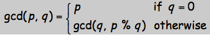
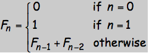
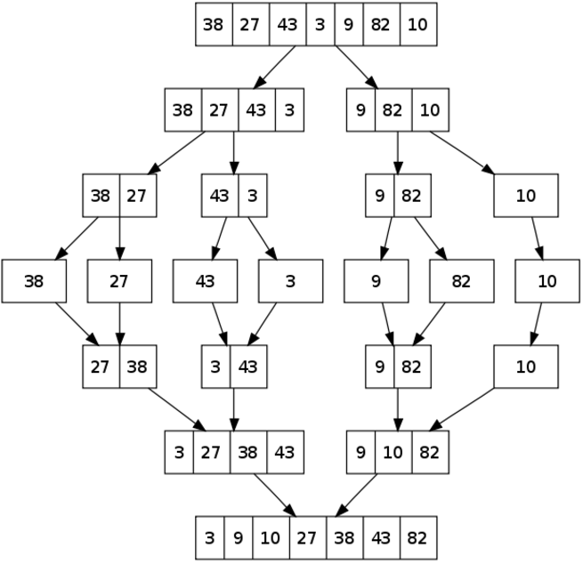

# recursion, sort

## recursion(递归)
- greatest common divisor (GCD, 最大公约数)



- fibonnaci series 



fibonacci(0) 一次计算

fibonacci(1) 一次计算

fibonacci(2) 3次

fibonacci(3) 5次

fibonacci(4) 9次

fibonacci(5) 15次

几乎是在成倍增长，指数爆炸，效率很低

使用dynamic programming会快很多

## demo project: sort

python自带sorted函数
```
>>> sorted([2,51,31,12,8,14,55,11])
[2, 8, 11, 12, 14, 31, 51, 55]
```

```
MergeSort(arr)
	if length of arr is 1:
		return arr
	else:
		1. Find the middle point to divide the array 
		2. Call mergeSort for first half
		3. Call mergeSort for second half
		4. Merge the two halves sorted in step 2 and 3
```




